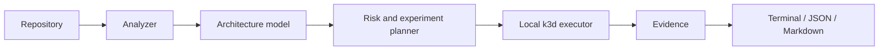

# CloudForge

CloudForge is an open-source CLI for proving how containerized applications
behave under production-like Kubernetes conditions. It combines deterministic
repository understanding with measured runtime experiments and evidence-based
regression reporting.

> **Current status:** CloudForge implements environment diagnostics, read-only
> repository analysis, and a first Docker-to-k3d readiness verification path.
> Analysis includes normalized container and Kubernetes configuration findings;
> verification adds normalized Trivy findings, bounded k6 load measurements,
> HPA scaling evidence, stable terminal, JSON, and Markdown reports, explicit
> baseline regression comparison, and a trust-separated GitHub Action with
> artifact and pull-request reporting.

## Why CloudForge

Builds and static checks cannot show whether readiness gates traffic, SIGTERM
drops requests, a replacement pod recovers promptly, or a rollout introduces
downtime. CloudForge is being built to run these scenarios in disposable k3d
clusters and report the observed evidence.



## Install from source

CloudForge currently requires Go 1.27:

```console
go install github.com/noor15102002/cloud-forge/cmd/cloudforge@latest
```

For development, clone the repository and run `make build`. Runtime verification
will require Docker, k3d, kubectl, k6, and Trivy; repository analysis does not.

## Commands

```console
cloudforge version
cloudforge doctor
cloudforge doctor --format json
cloudforge analyze .
cloudforge analyze ./services/api --format json
cloudforge verify .
cloudforge verify ./services/api --format json
cloudforge verify ./services/api --format markdown
cloudforge verify ./services/api --baseline ./baseline.json
cloudforge report ./verification.json --format markdown
```

`analyze` supports application roots containing Node.js, TypeScript, or Python
metadata, root Dockerfiles, and plain Kubernetes Deployment, Service, and HPA
manifests. It recognizes Helm and Compose but does not render or analyze them
yet. It reports source-linked findings for container users and ports, probes,
replicas, resources, Service ports, and HPA ranges. It does not execute
repository code.

Verification JSON is the canonical report and uses the versioned `v1alpha1` schema
defined in [`schemas/verification.v1alpha1.schema.json`](schemas/verification.v1alpha1.schema.json).
Collections are sorted for repeatable output; consumers must not depend on JSON
object key ordering. Verification also supports concise terminal output and a
Markdown report suitable for a pull-request comment.
See [the reporting guide](docs/reporting.md) for the format contracts.

Pass a previously saved verification JSON report with `--baseline`. CloudForge
compares experiment statuses and normalized numeric measurements with an
explicit quality direction, while keeping absolute findings separate from
relative regressions. A detected regression exits with status `1`; missing,
skipped, nonnumeric, or unit-incompatible evidence is reported as unavailable
instead of being treated as a regression. Baselines are read before repository
code executes and must be strict, bounded `v1alpha1` JSON files.

`verify` builds the root Dockerfile, creates a uniquely named k3d cluster,
imports the image, deploys a generated Namespace, Deployment, and Service, and
records build and readiness evidence. When an HTTP readiness endpoint is
declared, it measures startup and readiness status, then deletes one ready pod
while sending continuous traffic and records replacement time, failed requests,
downtime, restarts, and final health. It also measures traffic during graceful
SIGTERM termination and rebuilds the working tree as synthetic versions `a`
and `b` to observe a rolling Deployment update. It deletes the cluster and both
temporary images after success, failure, timeout, or cancellation. Use
`--keep-environment` only when you need to inspect the cluster manually.
Verification executes Dockerfile instructions and application code, and scans
the initial image with Trivy. Use it only with repositories you trust.

This slice reports detected vulnerabilities as warnings while preserving
Trivy's lowercase severity. A configurable blocking policy belongs to the
later regression and reporting work.

When an analyzed HPA safely targets the selected Deployment, verification
applies a generated autoscaler after the lifecycle experiments. It waits for
CPU metrics, runs a fixed 16-user, 20-second k6 profile, and records request
count, throughput, error rate, P50/P95/P99 latency, starting and peak replicas,
and scale-up duration. The generated HPA is capped at five replicas for local
developer machines. Missing metrics produce explicit skipped evidence rather
than an invented scaling result.

The packaged GitHub Action installs pinned runtime tools, uploads JSON and
Markdown reports, supports explicitly selected baseline artifacts, and updates
one stable pull-request comment through a separate trusted workflow. See the
[GitHub Action guide](docs/github-action.md) for pinned usage and the fork
security model.

## Security and limitations

Analysis reads bounded metadata files, skips generated directories and
symbolic links, and does not load environment files or return Secret values.
Verification builds and runs repository code, which must be treated as
untrusted outside an isolated environment. See [SECURITY.md](SECURITY.md)
and [docs/security.md](docs/security.md).

Linux and WSL2 are the primary targets. See [the roadmap](docs/roadmap.md),
[architecture](docs/architecture.md), and [contribution guide](CONTRIBUTING.md).

Apache-2.0 licensed.
