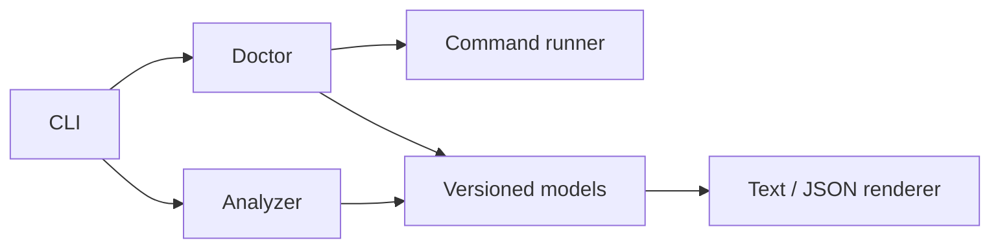

# Architecture

CloudForge uses explicit boundaries between repository discovery, architecture
models, future risk planning, execution, evidence, regression comparison, and
reporting.

The implemented slice contains:

- `internal/cli`: command definitions and exit semantics
- `internal/analyzer`: bounded repository traversal and structured parsers
- `internal/command`: the only subprocess execution boundary
- `internal/doctor`: local prerequisite checks
- `internal/render`: text and JSON serialization
- `pkg/model`: versioned output contracts

The analyzer never executes repository code. It uses structured JSON and TOML
parsing, the BuildKit Dockerfile parser, and official Kubernetes API types for
supported resources. Unsupported Kubernetes resources retain only identity and
provenance metadata.

Future executor adapters will depend on the same bounded command interface.
