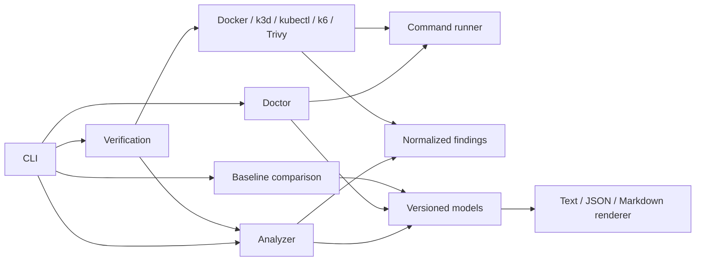

# Architecture

CloudForge uses explicit boundaries between repository discovery, architecture
models, capability planning, execution, evidence, regression comparison, and
reporting.

The implemented slice contains:

- `internal/cli`: command definitions and exit semantics
- `internal/analyzer`: bounded repository traversal and structured parsers
- `internal/command`: the only subprocess execution boundary
- `internal/safefile`: bounded regular-file reads without symlink traversal
- `internal/doctor`: local prerequisite checks
- `internal/executor`: Docker, k3d, kubectl, k6, and Trivy command adapters
- `internal/dependency`: pinned, owned Redis resource generation and safe identity
- `internal/findings`: deterministic container and Kubernetes configuration checks
- `internal/verification`: generated workload planning and lifecycle orchestration
- `internal/regression`: bounded baseline loading and deterministic comparison
- `internal/render`: canonical JSON plus terminal and Markdown reports
- `action.yml`: read-only Ubuntu verification and artifact packaging
- `.github/actions/report`: trusted report validation and stable comment update
- `pkg/model`: versioned output contracts

The analyzer never executes repository code. It uses structured JSON and TOML
parsing, the BuildKit Dockerfile parser, and official Kubernetes API types for
supported resources. Unsupported Kubernetes resources retain only identity and
provenance metadata.

Verification generates one narrowly scoped Kubernetes workload from
unambiguous analyzed metadata. Malformed or incomplete analysis stops before
execution while retaining the analyzer's findings and diagnostics in the
report. A fresh k3d cluster isolates every run. Every cluster and image cleanup
operation uses an independent bounded context so cancellation or one failed
deletion does not prevent later cleanup.

The generated Service uses a fixed NodePort mapped to a dynamically selected
loopback-only host port. This allows the Go HTTP probe to measure readiness and
send traffic during controlled pod deletion without exposing the application
on a non-loopback interface.

Verification rebuilds the same working tree as synthetic versions `a` and `b`,
using distinct immutable image tags and the public `CLOUDFORGE_VERSION` build
argument. Kubernetes pod image metadata proves the transition to version `b`.
Continuous loopback traffic spans controlled SIGTERM deletion and rollout so
request failures, downtime, readiness-count changes, and final health remain
part of the versioned evidence contract.

The autoscaler is applied only after replica-sensitive lifecycle experiments.
CloudForge waits for metrics-server to report CPU utilization, then runs a
bounded k6 profile against the loopback endpoint. It normalizes request count,
throughput, error rate, and P50/P95/P99 latency, while the Kubernetes adapter
decodes official HPA status types to record starting and peak replicas. Missing
metrics remain explicit skipped evidence with a diagnostic cause.

Verification JSON is canonicalized on a copy of the result before encoding:
evidence, measurements, findings, diagnostics, and comparison collections use
complete deterministic sort keys. The checked-in `v1alpha1` JSON Schema defines
required fields and enums. Explicit baselines are loaded through a bounded,
strict decoder before verification starts. The regression engine compares only
compatible environment/workload fingerprints, then statuses and normalized
metrics with declared quality directions; it does not
change the current run's absolute findings or status. Terminal output summarizes
experiments and actionable findings, while Markdown includes detailed
collapsible measurements and findings for pull-request comment integration.
Repository-derived Markdown text is escaped before output; the canonical JSON
retains the complete result when display limits apply.

GitHub integration uses two jobs with separate trust levels. The verification
job may execute pull-request code but has no write token or secrets. A later
`workflow_run` job loads its code from the default branch, treats the JSON
artifact as untrusted input, and receives narrowly scoped permission to update
the pull-request comment. The reporter never executes artifact content.

## Dependency extension

The existing verifier plans capabilities before any subprocess. Explicit Redis
resources are generated with official Kubernetes types, applied after cluster
bootstrap and made ready before application deployment. Unsupported required
dependencies block the plan. Restricted environment bindings are rendered only
into the private application manifest. Dependency startup evidence remains
separate from application findings. Semantic readiness applies bounded flat JSON
assertions to the readiness endpoint, including lifecycle traffic observations.

The same cluster ownership and independent cleanup contexts remove dependency
resources. v1alpha2 adds capability/dependency sections and fingerprints; the
legacy v1alpha1 schema remains readable. See [ADR 007](adr/007-explicit-dependency-runtime.md).

## Evidence reliability

The existing verifier performs a pure capability plan, compatibility preflight,
and sequential experiments around a shared validated baseline. Mutation attempts
trigger explicit restoration; controller revision, pods, dependencies and HTTP
readiness gate later siblings. Recovery evidence is attached to the original
experiment without replacing its status. v1alpha3 adds those records and
topology/producer identity; older report schemas remain immutable. See
[evidence reliability](evidence-reliability.md).
