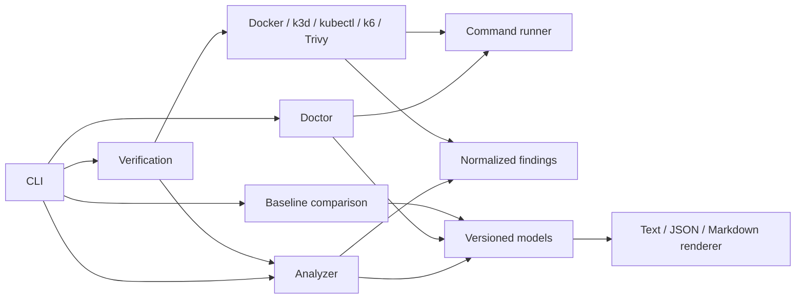

# Architecture

CloudForge uses explicit boundaries between repository discovery, architecture
models, future risk planning, execution, evidence, regression comparison, and
reporting.

The implemented slice contains:

- `internal/cli`: command definitions and exit semantics
- `internal/analyzer`: bounded repository traversal and structured parsers
- `internal/command`: the only subprocess execution boundary
- `internal/doctor`: local prerequisite checks
- `internal/executor`: Docker, k3d, kubectl, k6, and Trivy command adapters
- `internal/findings`: deterministic container and Kubernetes configuration checks
- `internal/verification`: generated workload planning and lifecycle orchestration
- `internal/regression`: bounded baseline loading and deterministic comparison
- `internal/render`: canonical JSON plus terminal and Markdown reports
- `pkg/model`: versioned output contracts

The analyzer never executes repository code. It uses structured JSON and TOML
parsing, the BuildKit Dockerfile parser, and official Kubernetes API types for
supported resources. Unsupported Kubernetes resources retain only identity and
provenance metadata.

Verification generates one narrowly scoped Kubernetes workload from
unambiguous analyzed metadata. A fresh k3d cluster isolates every run. Cleanup
uses a separate bounded context so cancellation of the experiment does not
cancel deletion.

The generated Service uses a fixed NodePort mapped to a dynamically selected
loopback-only host port. This allows the Go HTTP probe to measure readiness and
send traffic during controlled pod deletion without exposing the application
on a non-loopback interface.

Verification rebuilds the same working tree as synthetic versions `a` and `b`,
using distinct immutable image tags and the public `CLOUDFORGE_VERSION` build
argument. Kubernetes pod image metadata proves the transition to version `b`.
Continuous loopback traffic spans controlled SIGTERM deletion and rollout so
request failures, downtime, readiness-count changes, and final health remain
part of the versioned evidence contract.

The autoscaler is applied only after replica-sensitive lifecycle experiments.
CloudForge waits for metrics-server to report CPU utilization, then runs a
bounded k6 profile against the loopback endpoint. It normalizes request count,
throughput, error rate, and P50/P95/P99 latency, while the Kubernetes adapter
decodes official HPA status types to record starting and peak replicas. Missing
metrics remain explicit skipped evidence with a diagnostic cause.

Verification JSON is canonicalized on a copy of the result before encoding:
evidence, measurements, findings, diagnostics, and comparison collections use
complete deterministic sort keys. The checked-in `v1alpha1` JSON Schema defines
required fields and enums. Explicit baselines are loaded through a bounded,
strict decoder before verification starts. The regression engine compares only
statuses and normalized metrics with declared quality directions; it does not
change the current run's absolute findings or status. Terminal output summarizes
experiments and actionable findings, while Markdown includes detailed
collapsible measurements and findings for later PR comment integration.
Repository-derived Markdown text is escaped before output; the canonical JSON
retains the complete result when display limits apply.
